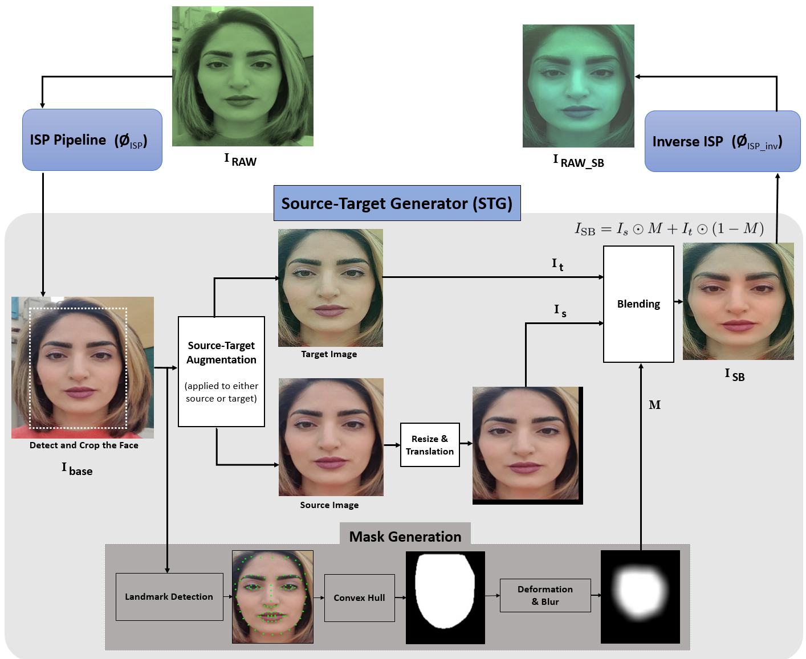

# Redrawing the Line Between Real and Fake: Enhancing Deepfake Detection with RAW Data
  

This repo includes the authors' PyTorch implementation for the following paper: 
> [**Redrawing the Line Between Real and Fake: Enhancing Deepfake Detection with RAW Data**]


# Recomended Development Environment
* GPU: NVIDIA A100
* CUDA: 11.1
* Docker: 20.10.8
* Use requirement.txt to install dependencies 

# Setup
## 1. Dataset
Download datasets and place them in `./data/` folder.  
For example, download [Celeb-DF-v2](https://github.com/yuezunli/celeb-deepfakeforensics) and place it:
```
.
└── data
    └── Celeb-DF-v2
        ├── Celeb-real
        │   └── videos
        │       └── *.mp4
        ├── Celeb-synthesis
        │   └── videos
        │       └── *.mp4
        ├── Youtube-real
        │   └── videos
        │       └── *.mp4
        └── List_of_testing_videos.txt
```
For other datasets, please refer to `./data/datasets.md` .


# Training
1. Download [FF++](https://github.com/ondyari/FaceForensics) real videos and place them in `./data/` folder:
```
.
└── data
    └── FaceForensics++
        ├── original_sequences
        │   └── youtube
        │       └── raw
        │           └── videos
        │               └── *.mp4
        ├── train.json
        ├── val.json
        └── test.json
```
2. Download landmark detector (shape_predictor_81_face_landmarks.dat) from [here](https://github.com/codeniko/shape_predictor_81_face_landmarks) and place it in `./src/preprocess/` folder.  

3. Execute both scripts to extract video frames, landmarks, and bounding boxes:
```bash
python src/preprocess/crop_dlib_ff.py -d Original
CUDA_VISIBLE_DEVICES=* python src/preprocess/crop_retina_ff.py -d Original
```

4.  Download the code for landmark augmentation. Landmark augmentation can improve the performance of the model (optional):
```bash
mkdir src/utils/library
git clone https://github.com/AlgoHunt/Face-Xray.git src/utils/library
```

5. Run the training:
```bash
CUDA_VISIBLE_DEVICES=* python src/train_raw_sbi.py \
src/configs/raw_sbi/base.json \
-n raw_sbi
```
Top five checkpoints will be saved in `./output/` folder.


# Test
Run the inference on Celeb-DF-v2:
```bash
CUDA_VISIBLE_DEVICES=* python src/inference/inference_dataset.py \
-w weights/FFraw.tar \
-d CDF
```
The result will be displayed.

Using the provided pretrained model, our cross-dataset results are reproduced as follows:

Training Data | CDF | DFD | DFDC 
:-: | :-: | :-: | :-: 
FF-raw | 94.23% | 98.46 | 69.42 


# Citation
If you have any questions, feedback, or inquiries related to this project, please feel free to reach out to us. You can find our contact information in the
ToDo

# Acknowledgements
Here are some great resources we benefit:
* https://github.com/mapooon/SelfBlendedImages
* https://github.com/q935970314/AIM22-ReverseISP-MiAlgo

Note: This repository is currently under construction, and we are actively working on adding more content. Please check back later for updates!
